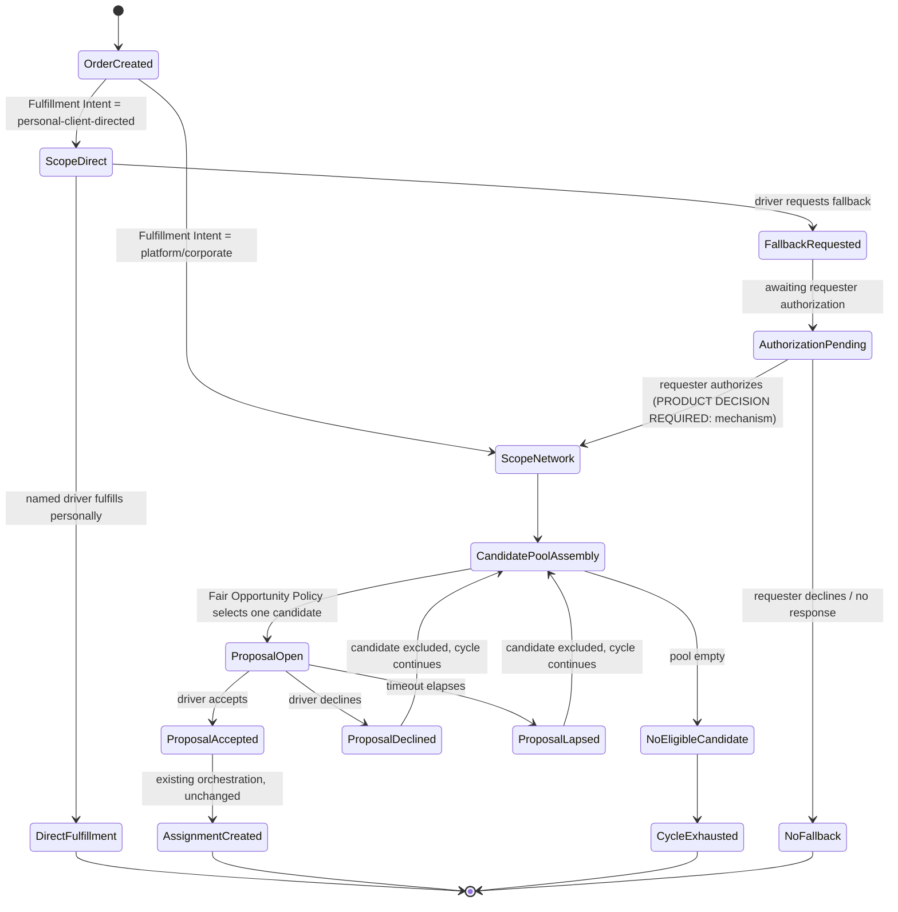
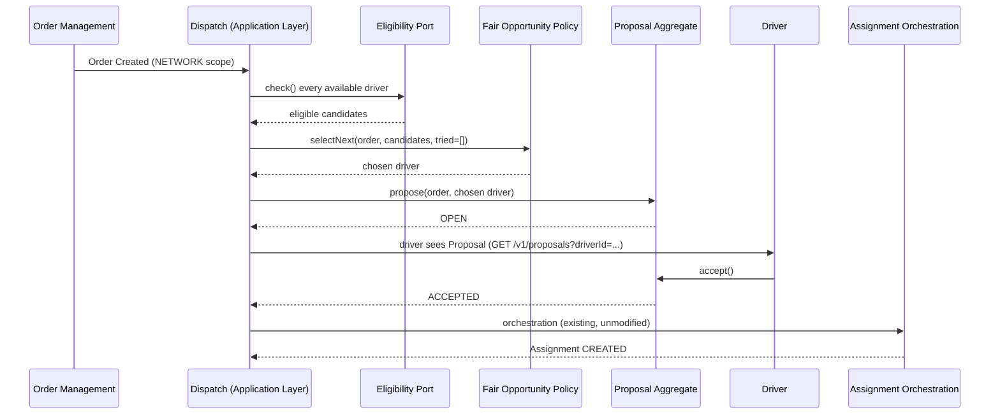
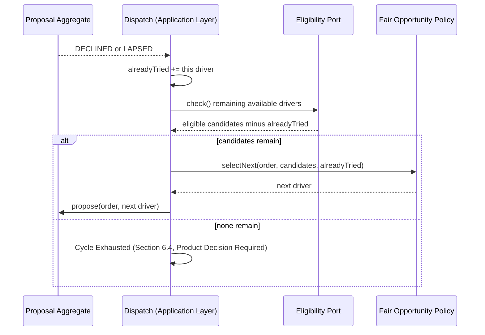
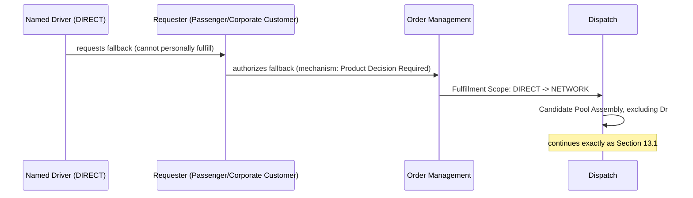
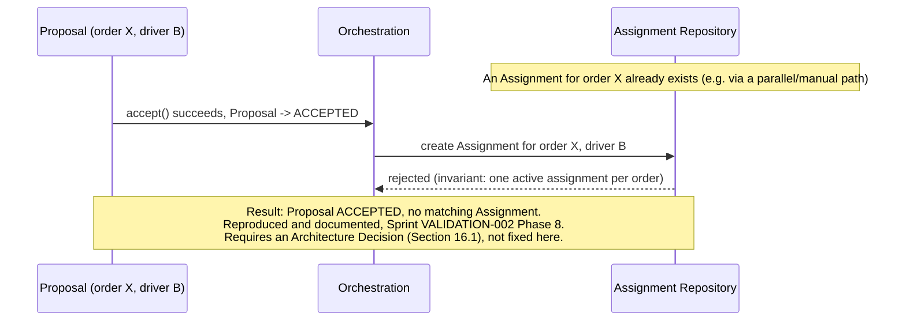

# Electronic Dispatcher — Product & Domain Design v1.0

Status: **Proposed — Design Blueprint, not yet a Product Decision or ADR.** This document is not itself an authority-bearing artifact under PROJECT_CONSTITUTION.md Section 5's Documentation Hierarchy. It is a consolidated engineering/product design proposal, produced for Product Owner review, that — once approved — is expected to be split into its proper ratified forms (one or more Product Decisions for the business questions it flags, one or more ADRs for the architecture it proposes, and a DOMAIN_MODEL.md extension for the concepts it names) before any implementation begins. Nothing in this document is ratified merely by being written here.

This document designs how manual Coordinator-driven candidate selection (the current, proven MVP) is replaced by an **Electronic Dispatcher**: an automatic mechanism that selects a candidate driver, creates a Proposal, and — on acceptance — reaches Assignment, exactly through the already-built and already-proven `Proposal → Accept → Assignment` chain (Sprints IMPLEMENTATION-001 through 005, verified end-to-end by real execution in Sprint VALIDATION-002). **Nothing about the already-proven chain changes.** This document designs only what selects the candidate and what happens around a decline, a timeout, or an exhausted candidate pool.

## 0. Scope, Method, and What This Document Builds On

### 0.1 Governing method

Every claim below carries one of five tags, extending the evidence-grading discipline already established by every Product Decision this document builds on:

- **[RATIFIED]** — stated or directly, unambiguously implied by an approved document, or directly observable in committed, tested code.
- **[DERIVED]** — a genuine design act of this document: reasoning from already-ratified principles to a specific mechanical/architectural question those principles do not themselves answer, in a way that cannot be read as contradicting anything above it in the hierarchy. This tag covers *engineering* choices (how a mechanism works), never business policy.
- **[HYPOTHESIS]** — a candidate business factor or mechanism named for evaluation, not adopted.
- **[OPEN]** — a question already left open by an existing ratified document, restated here, not resolved.
- **[PRODUCT DECISION REQUIRED]** — a question this document identifies as needing Product Owner authority, per PROJECT_CONSTITUTION.md Section 7. Every instance names: what must be decided, why, the alternatives, the trade-offs, and — only where one is warranted — a recommendation. **A recommendation is never a decision.**

Nothing tagged [HYPOTHESIS], [OPEN], or [PRODUCT DECISION REQUIRED] is treated as adopted, required, or implemented anywhere in this document.

### 0.2 What already exists and does not change

**[RATIFIED — proven by real execution, Sprint VALIDATION-002]:**

- `Order` (Order Management) — submitted, tracked, unaffected by anything in this document.
- `Proposal` (Dispatch; ADR-035's "pre-commitment business fact," named "Proposal" by the project's own Ubiquitous Language Validation exercise — see Section 17.2 for a terminology note) — `OPEN → ACCEPTED | DECLINED | LAPSED`, root invariant "at most one `OPEN` Proposal per order at a time," Dispatch-owned exclusively.
- `Assignment` (Dispatch) — `CREATED → ACCEPTED`, "an order cannot be connected to more than one active assignment at a time" (DOMAIN_MODEL.md Section 11), created automatically from an `ACCEPTED` Proposal via `ProposalAssignmentOrchestrationService` (Sprint IMPLEMENTATION-004).
- The REST/application boundary for all of the above.

**This document does not modify any of it.** Automatic Dispatch is a new *input* to `Proposal.propose()` — replacing the Coordinator's manual choice of `driverId` — never a new state, new invariant, or new lifecycle on `Proposal` or `Assignment` themselves.

### 0.3 Documents this design is downstream of, and does not redecide

`PRODUCT_DECISION_DISPATCH_PHILOSOPHY.md`, `PRODUCT_DECISION_FULFILLMENT_AUTHORITY_SCOPE.md`, `PRODUCT_DECISION_OPPORTUNITY_ACCEPTANCE_COMMITMENT.md`, `PRODUCT_DECISION_ELIGIBILITY_MINIMUM_TRUST_BOUNDARY.md`, `PRODUCT_DECISION_FAIR_OPPORTUNITY_POLICY.md`, `PRODUCT_DECISION_PERSONAL_CLIENT_RELATIONSHIP.md`, `PRODUCT_DECISION_OPPORTUNITY_BEFORE_ASSIGNMENT.md`, `PRODUCT_DECISION_MVP_PILOT_BOUNDARY.md`, ADR-002, ADR-034, ADR-035. Every open question those documents already left open is **restated, never resolved, here** — this document's own job is to give those open questions a precise place in a concrete design, not to answer them by default.

---

## 1. Business Terminology (Ubiquitous Language)

| Term | Meaning | Status |
| --- | --- | --- |
| **Order** | A tracked request for transportation (Order Management). | [RATIFIED] |
| **Order Origin** | Fixed-at-submission source of an order: platform-aggregated, corporate, or personal-client-directed. | [RATIFIED] |
| **Fulfillment Intent** | The requester's expressed way they intend the order fulfilled at submission. | [RATIFIED, `PRODUCT_DECISION_FULFILLMENT_AUTHORITY_SCOPE.md`] |
| **Fulfillment Scope** | DIRECT (named driver) / NETWORK (open Dispatch allocation) / REFERRED (name only, [OPEN]). | [RATIFIED as concept; DIRECT/NETWORK derived, REFERRED open] |
| **Fulfillment Authority** | Permission determining which mechanism may fulfill a request; only the requester may authorize expansion beyond original intent. | [RATIFIED] |
| **Eligibility** | Binary gate: may this driver be considered at all. Never a ranking. | [RATIFIED as concept, DERIVED status] |
| **Candidate Pool** | The set of Eligible, Available drivers considered for one Dispatch Cycle. | **New, this document** |
| **Dispatch Cycle** | One Order's journey through zero or more Proposals until Assignment or exhaustion. | **New, this document** |
| **Proposal** | A single, driver-specific pre-commitment fact — Dispatch's proposed pairing awaiting the driver's own resolution. | [RATIFIED, implemented] |
| **Fair Opportunity Policy** | The (unimplemented) decision of which eligible candidate is proposed next. | [RATIFIED as named gap; ADR-034 Part 3/4] |
| **Assignment** | The settled outcome once a Proposal is accepted. | [RATIFIED, implemented] |
| **Personal Client Relationship (PCR)** | Recognized, recurring relationship between a driver and a passenger/corporate customer. | [RATIFIED as concept; no lifecycle] |
| **Participant Origin / Referral Origin** | How a participant came to join the network (platform-direct, invited by a driver, invited by a passenger, ...). | **New, this document** — see Section 10 |

**Explicitly not synonyms** (repeating, because conflating any pair of these is the single most common domain-modeling error this design must avoid): Eligibility ≠ ranking. Availability ≠ Eligibility. PCR ≠ Referral Origin. Order Origin ≠ Fulfillment Scope (Origin is fixed at submission and historical; Scope is the current authorization state and can change once, DIRECT→NETWORK, per Section 9). Referral Origin ≠ preferred-driver priority.

---

## 2. Dispatch Lifecycle — Order Created → Assignment Created

### 2.1 State diagram



### 2.2 Every intermediate state, named

1. **Order Created** — [RATIFIED], unchanged (Order Management).
2. **Scope Determination** — [RATIFIED derivation]: Fulfillment Intent, fixed at submission, determines DIRECT vs NETWORK (`PRODUCT_DECISION_FULFILLMENT_AUTHORITY_SCOPE.md` Section 3).
3. **Direct Fulfillment** — outside Dispatch's concern entirely, unchanged, [RATIFIED].
4. **Fallback Requested / Authorization Pending** — [RATIFIED mechanism, OPEN mechanism-detail]: a driver may request; only the requester may authorize (Section 4 of that same document). The concrete authorization mechanism (manual per-order vs. pre-authorized) is `PRODUCT_DECISION_FULFILLMENT_AUTHORITY_SCOPE.md`'s own Section 6 open question, **restated, not resolved, here.**
5. **Candidate Pool Assembly** — **new, this document**, Section 4.
6. **Proposal Open / Accepted / Declined / Lapsed** — [RATIFIED, implemented] states of the existing `Proposal` aggregate.
7. **Cycle continuation on Decline/Lapse** — **new, this document**, Section 6.
8. **Assignment Created** — [RATIFIED, implemented], via the existing, unmodified orchestration.
9. **Cycle Exhausted** — **new, this document**; what happens next is [PRODUCT DECISION REQUIRED], Section 15.1.

**Important boundary:** "Dispatch Cycle" (state 5 onward) is an **application-layer orchestration concept, not a new persisted aggregate.** It is fully reconstructable at any time from data that already exists: `Proposal.findByOrder(order)`. No new aggregate root, table, or invariant is required to represent "which candidates have already been tried" — see Section 6.1.

---

## 3. Eligibility

Reusing `PRODUCT_DECISION_ELIGIBILITY_MINIMUM_TRUST_BOUNDARY.md` directly — **this document does not redefine Eligibility.** It only places the already-ratified definition into a concrete mechanism.

### 3.1 Confirmed conditions (usable today, no new contract needed)

| Condition | Status |
| --- | --- |
| Driver identity exists (Driver Management) | [RATIFIED] |
| Driver's own declared Availability = `AVAILABLE` | [RATIFIED, implemented] |
| Driver has no other `OPEN` Proposal for **this same order** | [RATIFIED — already the Proposal aggregate's own Root Invariant] |

### 3.2 Derived, engineering-only additions (this document's own act — not new business rules)

- **A driver who was just proposed and declined/lapsed within the current Dispatch Cycle is excluded from re-selection within that same cycle.** [DERIVED] — a direct, mechanical consequence of the cycle-continuation design (Section 6), not a new fairness policy; it prevents an infinite loop proposing the same driver to themselves, nothing more.
- **A driver's Eligibility is re-checked at the moment a new Proposal is about to be created for them, not only when the candidate pool was assembled.** [DERIVED] — closes the "driver went unavailable between selection and proposal" race, a pure implementation-quality concern (see Section 8).

### 3.3 Candidate future conditions — none built, none chosen

| Candidate condition | Status | Why not confirmed |
| --- | --- | --- |
| Driver standing / participation | [OPEN, named not implemented] | No Driver Management concept exists yet beyond Availability; would need new domain modeling + new contract (ADR-034 Part 2). |
| Working area / geographic zone | [STRUCTURALLY UNSUPPORTED] | "No location, tracking, or positioning data is described or implied" anywhere (EVENT_CATALOG.md Section 7). Not even a candidate until a future, separate Domain Decision creates the concept. |
| Vehicle compatibility | [STRUCTURALLY UNSUPPORTED] | No vehicle concept exists anywhere in DOMAIN_MODEL.md. Same category as location. |
| Minimum trust / onboarding completion beyond manual admission | [HYPOTHESIS] | `PRODUCT_DECISION_ELIGIBILITY_MINIMUM_TRUST_BOUNDARY.md` Section 8's own MVP candidate (Identity + manual admission + Availability); not selected there, not selected here. |

### 3.4 Temporary ineligibility

- **`UNAVAILABLE`** — [RATIFIED]. A driver's own active declaration excludes them from any candidate pool assembled while it holds.
- **Currently holding an `OPEN` Proposal for a *different* order** — **[PRODUCT DECISION REQUIRED, new question]:** should a driver be excluded from a second order's candidate pool while they have an unresolved Proposal elsewhere? See Section 15.7.
- **Currently holding an `ACCEPTED` Proposal awaiting Assignment, or an active `Assignment`** — [DERIVED, recommended default]: excluded, on the same reasoning as 3.2 — a driver already committed elsewhere has no realistic capacity, and Availability itself should normally already reflect this once a driver declares `UNAVAILABLE` upon accepting. This document does not invent a *new* signal to detect it automatically; it only recommends the candidate-pool query also defensively check for an existing non-terminal Assignment for that driver, mirroring the same defense-in-depth reasoning as 3.2.
- **PCR-affected temporary ineligibility** — [OPEN], unchanged from `PRODUCT_DECISION_ELIGIBILITY_MINIMUM_TRUST_BOUNDARY.md` Section 6.

---

## 4. Candidate Selection

### 4.1 How the candidate set is created

**[DERIVED — engineering mechanism, not a business rule.]**

```
CandidatePool.assemble(order, alreadyTriedInThisCycle):
    available := DriverAvailabilityRepository.findAllAvailable()   // NEW query, see 4.3
    eligible  := available.filter { Eligibility.check(it) }        // Section 3
    return eligible.excluding(alreadyTriedInThisCycle)
```

`alreadyTriedInThisCycle` is computed, not stored: `Proposal.findByOrder(order).map { it.driver }.toSet()` — reusing the already-implemented repository method, **no new data structure.**

### 4.2 How filtering occurs

A simple, sequential, and-combined filter chain over Section 3's confirmed conditions — not a scored or ranked filter, consistent with Eligibility being a binary gate (`PRODUCT_DECISION_ELIGIBILITY_MINIMUM_TRUST_BOUNDARY.md` Section 1: "It never answers how should this driver be ordered"). Ordering among the *filtered result* is Fair Opportunity Policy's job (Section 5), never the filter's own.

### 4.3 A genuine, already-named implementation gap this design inherits

ADR-034 Part 6 already found: *"`DriverAvailabilityRepository` today only supports looking up one already-known driver reference (`findByDriverReference`), not 'every currently available driver,' which any real policy would need."* **[RATIFIED gap, unchanged.]** This document's Candidate Pool cannot be assembled at all until that query is added — a straightforward repository extension (mirroring `ProposalRepository.findByDriver`'s own precedent from Sprint IMPLEMENTATION-005), not an architectural change. Listed here as a concrete, scoped prerequisite for implementation, not as an open design question.

### 4.4 How unavailable drivers disappear

Two distinct moments, deliberately kept distinct:

1. **At pool assembly** — an unavailable driver is simply never included (the filter in 4.2 excludes them; nothing to "remove").
2. **Between assembly and proposal creation** (the race Section 3.2 names) — re-checked defensively immediately before `Proposal.propose()` is called; if the driver has become ineligible in that narrow window, the pool assembly step (4.1) is re-run rather than proceeding with a stale reference. This is the same "re-validate immediately before acting" discipline `Proposal.propose()`'s own Root Invariant already applies against `existingProposals` — extended one level earlier in the pipeline, not a new principle.

No driver is ever "removed" from a candidate mid-Proposal — once a Proposal is `OPEN`, its own lifecycle (Section 6) governs what happens to it; Candidate Pool membership is only ever evaluated at the moment of *creating* the next Proposal.

---

## 5. Fair Opportunity Policy — The Central Problem

**No algorithm is chosen here.** This section only classifies the business factors PRODUCT_DECISION_FAIR_OPPORTUNITY_POLICY.md already began classifying (its Sections 3–11), extended to explicitly cover every factor this design task named.

### 5.1 Factor classification table

| Factor | Classification | Owning module (if it existed) | Note |
| --- | --- | --- | --- |
| **Availability** | [RATIFIED input — but an Eligibility gate, not a fairness factor] | Driver Management | Binary precondition (Section 3), never itself a ranking signal. |
| **Driver status / standing** | [OPEN concept, not implemented] | Driver Management | Named in DOMAIN_MODEL.md Section 4, never built; ADR-034 Part 2's own "future candidate input." |
| **Working area** | [STRUCTURALLY UNSUPPORTED] | — | No location concept exists anywhere (Section 3.3). |
| **Vehicle compatibility** | [STRUCTURALLY UNSUPPORTED] | — | No vehicle concept exists anywhere (Section 3.3). |
| **Preferred driver relationship (PCR)** | [OPEN — three independently open questions, not collapsed into one] | Driver Mgmt + Passenger Experience (jointly) | See Section 5.2. |
| **Driver contribution to the network** | [HYPOTHESIS — "contribution-based priority"] | — | `PRODUCT_DECISION_FAIR_OPPORTUNITY_POLICY.md` Section 3: no approved document ties assignment to contribution/merit. |
| **Reciprocity** | [OPEN, excluded from Fundamental Laws] | — | Constitution Section 18; ADR-034 Part 4 names it only as one of several unranked candidates. |
| **Network demand contribution** ("balanced participation" reading) | [DERIVED-consistent extension, not itself ratified as a requirement] | — | Matches "Balanced Participation" (`PRODUCT_DECISION_FAIR_OPPORTUNITY_POLICY.md` Section 3) — a qualitative direction only, no measurable definition exists. |
| **Passenger preferences (a one-off NETWORK-scope driver preference, distinct from PCR)** | **[HYPOTHESIS — new, first surfaced by this document]** | — | No existing Product Decision evaluates this factor at all. Flagged, not adopted; see Section 15.11. |
| **Service quality** | [HYPOTHESIS] | — | No rating/performance concept exists anywhere in DOMAIN_MODEL.md. |
| **Equal opportunity** (every eligible driver has a genuine chance) | [DERIVED-consistent extension] | — | Procedural fairness's own qualitative direction; no measurable operationalization ratified. |
| **Payment / subscription tier** | [FORBIDDEN] | — | "Payment to PIOS should not secretly purchase higher priority" — restated a fourth time, unchanged. |

### 5.2 PCR's three distinct, still-open questions (repeated verbatim in structure, not resolved)

1. Does a PCR-directed order even reach Dispatch's assignment decision at all, or is DIRECT scope entirely outside Dispatch's concern until/unless fallback is authorized (Section 9)? **[OPEN]**
2. Does PCR affect the Eligibility gate? **[OPEN]**
3. Does PCR affect *priority within* an already-eligible NETWORK pool, once reached? **[OPEN]**

This document's own contribution is only to confirm, structurally, that **Candidate Selection (Section 4) and Fair Opportunity Policy (this section) both currently have zero ratified PCR input** — consistent with, not contradicting, all three open questions above.

### 5.3 Candidate mechanisms — evaluated, none chosen

Restating ADR-034 Part 4 and `PRODUCT_DECISION_FAIR_OPPORTUNITY_POLICY.md` Section 11 directly, unchanged: Simple FIFO, Round Robin, Ranking system, Scoring system, AI selection, Reciprocity engine, Reputation system — **all [HYPOTHESIS] or [OPEN], none selected, ranked, or implemented by this document.**

### 5.4 What this document does add: the shape of the decision, not its content

The Fair Opportunity Policy, whichever mechanism a future Product Decision selects, is designed here only as a **port** (Section 11) — receiving the Candidate Pool (Section 4) and returning one chosen driver reference or an explicit "no eligible candidate" outcome. Nothing about *how* that choice is made is decided by this document, exactly as ADR-034 Part 3 already established for the seam it named.

---

## 6. Proposal Queue

**Terminology reconciliation, stated plainly:** this design task's own vocabulary says `EXPIRED`; the already-implemented, already-tested code says `LAPSED` (`ProposalStatus.LAPSED`, 337 passing tests depend on this name). This document uses **`LAPSED`** throughout, as the ratified, shipped term — `EXPIRED` is treated as a synonym in business conversation, never a second code state.

### 6.1 The queue is not a queue — it is a derivation

There is no persisted "Proposal Queue" data structure. A Dispatch Cycle's history is always exactly `Proposal.findByOrder(order)`, ordered by creation time — already-implemented, already-tested. "Moving through the queue" means: whenever the most recent Proposal for an order resolves negatively (`DECLINED` or `LAPSED`) and the order's Fulfillment Scope is still NETWORK, Candidate Pool Assembly (Section 4) runs again, excluding every driver already tried.

### 6.2 Every transition, named

| From | To | Trigger | Consequence |
| --- | --- | --- | --- |
| *(none)* | `OPEN` | Fair Opportunity Policy selects a candidate | `OrderProposed` fires (internal only, unchanged) |
| `OPEN` | `ACCEPTED` | Driver accepts | Existing orchestration creates `Assignment`, unchanged (Sprint IMPLEMENTATION-004) |
| `OPEN` | `DECLINED` | Driver actively refuses | **New:** Dispatch Cycle continues — Section 6.3 |
| `OPEN` | `LAPSED` | Timeout elapses (Section 7) | **New:** Dispatch Cycle continues — Section 6.3, identical to Decline |
| *(cycle continuation)* | `OPEN` (a new Proposal) | Candidate Pool Assembly finds a next candidate | Same as row 1 |
| *(cycle continuation)* | *(cycle ends)* | Candidate Pool Assembly finds none remaining | **Cycle Exhausted** — Section 6.4 |

**Decline and Lapse are handled identically by the queue mechanism** — both simply exclude that driver and continue the cycle. They remain **conceptually distinct** (`PRODUCT_DECISION_OPPORTUNITY_ACCEPTANCE_COMMITMENT.md` Section 9: active refusal vs. passive non-response), and both remain **not a violation of anything** (Section 3 of that same document, unchanged) — this document does not attach any consequence, penalty, or record beyond the already-existing `DECLINED`/`LAPSED` status itself.

### 6.3 Cycle continuation, precisely

1. `Proposal` transitions to `DECLINED` or `LAPSED` (existing code, unchanged).
2. Candidate Pool Assembly (Section 4) re-runs for the same order, excluding every driver with a non-`OPEN` Proposal for it.
3. If a candidate remains: Fair Opportunity Policy selects one, a new `Proposal.propose()` call creates the next `OPEN` Proposal.
4. If none remains: Section 6.4.

No new state is added to `Proposal` or `Assignment` for this. The "cycle" is a pure application-layer orchestration loop around already-existing domain operations — mirroring exactly how `ProposalAssignmentOrchestrationService` already coordinates two existing operations without becoming a new aggregate itself (Sprint IMPLEMENTATION-004's own precedent).

### 6.4 Cycle Exhausted

**[PRODUCT DECISION REQUIRED — Section 15.1.]** No ratified document says what happens when a Dispatch Cycle runs out of candidates. This document names the state and its precondition; it does not invent the consequence (retry later, escalate to a human, notify the requester, or something else).

---

## 7. Timeout Strategy

### 7.1 Mechanism — [DERIVED, an engineering design, reusing an already-proven pattern]

A scheduled background process, mirroring `OutboxRelayScheduler`'s own already-proven, already-tested shape exactly (same `@EnableScheduling`/fixed-delay convention already used in this codebase):

```
ProposalTimeoutScheduler (fixed-delay tick, e.g. mirrors pios.outbox.relay.fixed-delay-ms convention):
    for each Proposal where status == OPEN and openedAt + timeoutDuration < now:
        proposal.lapse()
        proposalRepository.save(proposal)
        // triggers cycle continuation, Section 6.3
```

This requires one new, small addition to the `Proposal` aggregate: a recorded "opened at" timestamp (already implicitly available — `ProposalCreated`'s own `occurredAt`; whether it needs to become a queryable column, versus computed from the outbox/audit trail, is an implementation detail, not a design question this document leaves open).

### 7.2 The duration itself — [PRODUCT DECISION REQUIRED — Section 15.6]

How long a Proposal should remain `OPEN` is a genuine product trade-off (driver opportunity-visibility vs. passenger wait time), not an engineering parameter this document may default silently. The mechanism (7.1) is designed; the number is not chosen.

### 7.3 How the dispatcher continues afterward

Identical to a Decline (Section 6.3) — by design, so that "the driver said no" and "the driver never responded" require exactly one shared continuation mechanism, not two.

---

## 8. Failure Handling

| Scenario | Handling | Status |
| --- | --- | --- |
| **Driver offline / loses connection** | Indistinguishable from silent non-response; subsumed entirely by Timeout Strategy (Section 7) — no presence/heartbeat detection is designed or needed. | [DERIVED — the existing Lapse mechanism already correctly covers this] |
| **Driver accepts too late** (after Lapse already fired) | `Proposal.accept()`'s own existing invariant rejects a non-`OPEN` proposal (`IllegalStateException` → HTTP 409, already implemented and tested). | [RATIFIED, already correct, no new design needed] |
| **Duplicate acceptance** (race between two accept calls) | First wins (`OPEN→ACCEPTED`); second sees non-`OPEN`, rejected identically. Already proven in Sprint IMPLEMENTATION-004/005 tests. | [RATIFIED, already correct] |
| **Assignment already exists** (a second Proposal-acceptance path, or the deprecated manual endpoint, for the same order) | **Known, reproduced defect** (Sprint VALIDATION-002, Phase 8): the Proposal ends up `ACCEPTED` while `Assignment.create()`'s own invariant rejects the duplicate (409) — no shared transaction exists between the two writes. | **[RISK, carried forward — Section 16.1; requires an Architecture Decision, not invented here]** |
| **Network failures** (RabbitMQ, PostgreSQL unreachable mid-cycle) | Already-proven infrastructure: outbox + transactional writes + retry/DLQ (ADR-031/032, proven in Sprint VALIDATION-002's own real execution). The new `ProposalTimeoutScheduler` (Section 7.1) should reuse the identical pattern, not invent a new one. | [DERIVED — reuse, not redesign] |
| **Fair Opportunity Policy port throws / times out** | Not designed here — belongs to whichever concrete policy implementation is eventually chosen (Section 11); this document only requires that the port's own contract include an explicit failure/no-decision outcome, never a silent hang. | [DERIVED — a port-contract requirement, not a policy] |

---

## 9. Personal Customer Relationship — Decision Points, Not Policy

Reusing `PRODUCT_DECISION_FULFILLMENT_AUTHORITY_SCOPE.md` in full; this section places its already-ratified resolutions into the concrete Dispatch Lifecycle (Section 2), adding no new business rule.

### 9.1 Decision points, in order

1. **At submission:** Fulfillment Intent is DIRECT or NETWORK. [RATIFIED, fixed, unchanged.]
2. **If DIRECT and the named driver cannot personally fulfill:** the driver may *request* fallback; only the requester may *authorize* it. [RATIFIED, unchanged.]
3. **Once authorized — this document's own placement, not a new rule:** the order's **Fulfillment Scope** (not its Order Origin, which stays historical and fixed) transitions `DIRECT → NETWORK`. From that moment, Section 2's Candidate Pool Assembly begins exactly as for any NETWORK order.
4. **Is the original named driver excluded from the resulting candidate pool?** [DERIVED, recommended]: yes — they already indicated they cannot fulfill it; re-proposing to them would be a pointless cycle, not a fairness question. This is a mechanical consequence of 6.1's own "exclude already-tried drivers" logic, extended to also exclude the DIRECT-scope driver as the cycle's own starting exclusion, not a new principle requiring separate ratification.

### 9.2 What information is preserved (a hard boundary, restated)

- **PCR ownership never transfers** — unchanged (`PRODUCT_DECISION_FULFILLMENT_AUTHORITY_SCOPE.md` Section 4).
- **Dispatch never gains access to PCR details.** Only the bare fact "this order's Fulfillment Scope is now NETWORK" crosses into Dispatch's Candidate Pool Assembly — never who the original relationship was, never any PCR attribute. This is the same "no disclosure as an incidental side effect" boundary already ratified, applied concretely to this design's own new Scope-transition mechanism.
- **No permanent effect.** The Scope transition is scoped to this one order; it does not alter the underlying PCR's own standing.

### 9.3 What remains open (restated, not resolved)

Whether passenger authorization is manual-per-order or ever pre-authorized ([OPEN], Section 15.9); whether PCR carries any weight once NETWORK scope is reached ([OPEN], Section 5.2 item 3).

---

## 10. Referral Origin

### 10.1 The concept, placed precisely

**Participant Origin** (this document's own new term) describes **how a participant came to exist within the network** — platform-direct signup, invited by an existing Driver, invited by an existing Passenger, or (future, unratified) invited by another participant type. It is recorded **once**, at the participant's own onboarding, as a historical fact about *that participant*, never about any specific order, ride, or dispatch decision.

### 10.2 Ownership

[DERIVED, following the already-ratified pattern that each module owns facts about its own participants]: Passenger Experience would own a Passenger's own Participant Origin; Driver Management would own a Driver's own Participant Origin if driver-invites-driver is ever modeled (no evidence exists for this today — not designed). No new cross-module contract is implied; this is analogous to how Driver Management already owns Availability and exposes only a narrow projection elsewhere.

### 10.3 Hard boundaries this document actively designs in (not merely notes)

- **Participant Origin is never read by Dispatch.** No contract in `INTERFACE_CONTRACTS.md` Section 5 exposes it, and none is proposed here.
- **Participant Origin never influences Candidate Selection (Section 4) or Fair Opportunity Policy (Section 5).** It is not a fairness factor, not an Eligibility condition, and not a priority signal, under any circumstance this document designs.
- **Participant Origin is not Personal Client Relationship.** An invited passenger does not automatically hold a PCR with their inviter — PCR remains a distinct, separately-recognized, recurring relationship (Part 1 of `PRODUCT_DECISION_PERSONAL_CLIENT_RELATIONSHIP.md`, unchanged); being invited by someone is a one-time historical fact, not an ongoing relationship.
- **Participant Origin is not ride execution or preferred-driver routing.** It plays no role anywhere in Sections 2, 6, or 9.

### 10.4 What is left open

- Should Participant Origin ever be visible to Analytics, to measure network-growth channels? **[OPEN, new question]** — no contract exists, none proposed; Analytics already only ever consumes, never decides (DOMAIN_MODEL.md Section 7).
- Should a referred participant's origin ever gate anything (for example, a sponsor-vouching trust signal)? **[OPEN, new question]** — `PRODUCT_DECISION_ELIGIBILITY_MINIMUM_TRUST_BOUNDARY.md` already treats automatic trust signals cautiously (Section 7); this document does not propose one.

---

## 11. Future Dispatch Policy — Extension Points

### 11.1 Refined architectural diagram (supersedes ADR-034 Part 3's diagram a second time, exactly as ADR-035 already did once)

```
Dispatch infrastructure (unchanged: RabbitMQ, outbox, JDBC repositories)
        |
        v
Application layer (ProposeDriverCommand's own future caller)
        |
        v   NEW: Eligibility port
Eligibility.check(driver) -> Boolean
        |
        v   NEW: Candidate Pool assembly (Section 4) -- an application-layer
        |    procedure, not a persisted aggregate or a new port itself
Candidate Pool
        |
        v   NEW port this document names: Fair Opportunity Policy
FairOpportunityPolicy.selectNext(order, candidatePool, alreadyTried)
        -> DriverReference | NoEligibleCandidate
        |
        v
Proposal.propose(order, chosenDriver)   -- existing, unmodified
        |
        v   (existing, unmodified orchestration)
Assignment.create()
```

### 11.2 Why this shape

Mirrors this exact codebase's own already-proven port pattern (`EventPublisher`, `OutboxRepository`, `TransactionRunner`, and ADR-034 Part 3's own `Assignment Policy` naming) — a narrow, technology-free interface infrastructure never reaches through, swappable via ordinary dependency injection, requiring no change to RabbitMQ topology, the outbox, the scheduler, or any persistence adapter when the policy itself changes. **No concrete implementation is chosen by this document** — exactly ADR-034 Part 3's own discipline, applied one step further downstream now that ADR-035 has inserted `Proposal` between policy decision and `Assignment`.

### 11.3 Two separate ports, deliberately not one

`Eligibility` and `FairOpportunityPolicy` are kept as two distinct extension points, not one combined "matching" port — because Eligibility is a binary gate everyone agrees on the meaning of (Section 3), while Fair Opportunity Policy is the genuinely contested, still-unratified ordering question (Section 5). Merging them into one interface would make a future policy implementation responsible for re-deciding Eligibility every time it's invoked, exactly the coupling this design avoids.

---

## 12. Aggregates, Entities, Value Objects — Consolidated

**Unchanged (do not touch):** `Order`, `Proposal`, `Assignment`, `Driver` — and every Value Object/Entity DOMAIN_MODEL.md Sections 4–6 already names.

**New concepts this document introduces — each explicitly Domain Decision Required before DOMAIN_MODEL.md itself is extended, per that document's own discipline (Section 5's own text: "Where this document is silent... resolution requires a new ADR"):**

| Concept | Kind | Persisted? |
| --- | --- | --- |
| Fulfillment Scope | Value Object | Yes — a field on Order (or a Dispatch-local projection of it), exact placement is an implementation decision for the future ADR this document recommends |
| Candidate Pool | Ephemeral application-layer concept | No — computed on demand, never stored |
| Dispatch Cycle | Ephemeral application-layer concept | No — derived from `Proposal.findByOrder`, never stored |
| Eligibility | Application-layer port / Driver-Management-owned fact | Only if Section 3.3's candidate conditions are ever built; Identity+Availability need no new storage |
| Fair Opportunity Policy | Application-layer port | No — a port, like `EventPublisher` |
| Participant Origin / Referral Origin | Value Object | Yes — owned by Passenger Experience (and, if ever modeled, Driver Management) |

---

## 13. Sequence Diagrams

### 13.1 Automatic NETWORK dispatch — happy path



### 13.2 Decline / timeout → next candidate



### 13.3 DIRECT → fallback → NETWORK entry



### 13.4 Known risk: Assignment-already-exists race (documented, not fixed here)



---

## 14. Business Invariants — Proposed (require DOMAIN_MODEL.md ratification, not yet ratified)

1. An order has at most one active Dispatch Cycle at a time. [DERIVED directly from `Proposal`'s own existing per-order `OPEN` invariant — not a new constraint, a restatement at the cycle level.]
2. A driver is never proposed twice within the same Dispatch Cycle for the same order. [DERIVED — Section 6.1's own exclusion logic.]
3. Fair Opportunity Policy may never consult a forbidden input (restating ADR-034 Part 2's list: payment/pricing, Passenger/Corporate Customer profile data, Driver profile/standing/ranking beyond Availability, Notification history, Analytics/Insight, any external system's data) — extended explicitly to also forbid Participant Origin (Section 10.3) and any payment/subscription tier (Section 5.1).
4. A Candidate Pool must never include a driver excluded by Eligibility at the moment a Proposal is actually created for them (Section 4.4's defense-in-depth re-check).
5. [OPEN, not an invariant until Section 15.7 resolves it] — whether a driver may hold more than one `OPEN` Proposal simultaneously across different orders.

---

## 15. Product Decisions Required — Consolidated

Every instance below follows: **what / why / alternatives / trade-offs / recommendation (if any).** None is decided by this document.

### 15.1 What happens when a Dispatch Cycle is exhausted (no eligible candidate accepts)?

**Why:** Section 6.4 names the state; no ratified document says what happens next.
**Alternatives:** (a) retry later on a delay, re-running Candidate Pool Assembly against possibly-changed Availability; (b) escalate to a human/Coordinator (the still-existing, deprecated-but-functional manual path); (c) notify the requester the order could not be automatically fulfilled and leave it to them.
**Trade-offs:** (a) risks indefinite silent delay with no visibility to the requester; (b) reintroduces a manual step Automatic Dispatch exists to remove, but is the lowest-risk fallback for a pilot; (c) is the most transparent but pushes the burden back to the requester with no platform-provided resolution.
**Recommendation:** none offered — this is a genuine product trade-off between automation completeness and passenger experience, not an engineering call.

### 15.2–5. PCR's three open questions + Eligibility criteria beyond Identity/Availability

Restated verbatim from Sections 5.2 and 3.3 — see those sections for the full why/alternatives already recorded in their own source documents. Not re-litigated here.

### 15.6 Proposal timeout duration

**Why:** Section 7.2 — a real trade-off between driver opportunity-visibility and passenger wait time.
**Alternatives:** a short window (seconds/low minutes, favors passenger wait time, risks drivers not noticing in time); a longer window (minutes, favors drivers, risks passenger abandonment).
**Trade-offs:** no market data exists yet to calibrate either.
**Recommendation:** none offered — but note that whatever value is chosen should be a configuration value (mirroring `pios.outbox.relay.fixed-delay-ms`'s own existing convention), never hardcoded, so it can be tuned without a code change once real pilot data exists.

### 15.7 May a driver hold more than one `OPEN` Proposal simultaneously (across different orders)?

**Why:** genuinely new question, not previously surfaced by any existing document — the current `Proposal` Root Invariant is per-*order*, not per-*driver*.
**Alternatives:** (a) allow it — a driver may be a candidate for several orders at once, first-to-accept wins each independently; (b) forbid it — a driver with one open proposal is excluded from every other candidate pool until resolved.
**Trade-offs:** (a) maximizes driver-side opportunity but risks a driver accepting two overlapping jobs if Availability isn't also updated defensively; (b) is simpler and safer but could slow down overall network throughput if a driver's outstanding proposal lapses slowly.
**Recommendation:** (b) is the lower-risk default for a first Automatic Dispatch rollout, consistent with this document's own conservative posture elsewhere (Section 3.4) — but this is still a recommendation, not adopted.

### 15.8 Cross-aggregate transaction consistency (carried forward from Sprint VALIDATION-002)

**Why:** a real, reproduced defect (Section 8, Section 16.1) — `Proposal` can end `ACCEPTED` with no matching `Assignment`. Automatic Dispatch increases the volume and automation of writes that could hit this window.
**Alternatives:** (a) wrap Proposal-accept and Assignment-create in one shared JDBC transaction — technically possible (same database), but tensions with ADR-035's own Aggregate Boundary Justification, which used independent transactional boundaries as one argument *for* separate aggregates; (b) a compensating action (e.g., an automatic "revert to a re-triable state" if Assignment creation fails) — would require a new Proposal state or transition, explicitly forbidden to invent here without approval; (c) an operational/monitoring answer — detect and alert on the inconsistency rather than prevent it architecturally.
**Recommendation:** this is an **Architecture Decision**, not a product one — flagged for a dedicated ADR before or alongside Automatic Dispatch implementation, not resolved here.

### 15.9 Fulfillment Authority mechanism: manual-per-order vs. pre-authorized

Restated from `PRODUCT_DECISION_FULFILLMENT_AUTHORITY_SCOPE.md` Section 6 — unchanged, not re-decided.

### 15.10 REFERRED scope

Restated from `PRODUCT_DECISION_FULFILLMENT_AUTHORITY_SCOPE.md` Section 3 — remains a name only, not designed by this document either.

### 15.11 Passenger preference as a NETWORK-scope fairness factor

**Why:** newly surfaced by this document (Section 5.1) — no existing Product Decision evaluates whether a passenger expressing a one-off driver preference (distinct from a durable PCR) should ever influence Candidate Selection or Fair Opportunity Policy.
**Alternatives:** (a) never a legitimate input — NETWORK scope exists precisely because no specific driver was named; (b) a legitimate, narrow input (e.g., "avoid a specific driver I had a bad experience with") distinct from positive steering toward one; (c) requires its own future Product Decision before any position is taken.
**Recommendation:** (c) — this document takes no position; it only insists the question not be silently answered "yes" by default engineering convenience.

### 15.12 Referral Origin visibility and any gating role

Restated from Section 10.4 — new questions, not resolved.

---

## 16. Risks

### 16.1 Cross-aggregate consistency gap (highest-priority risk)

Reproduced by direct execution in Sprint VALIDATION-002 Phase 8: an `ACCEPTED` Proposal can exist with no matching `Assignment` when the order already has one via a parallel path. Automatic Dispatch does not create this risk, but increases its practical surface (more automatic, scheduler-driven writes). See Section 15.8. **Recommend resolving or explicitly accepting this risk before Automatic Dispatch reaches production volume**, not before this design is approved.

### 16.2 Terminology drift already present in the repository

`DOMAIN_MODEL.md` Section 4 still names the Proposal aggregate "Pre-Commitment Business Fact (Dispatch) — Name Not Yet Ratified," even though the project's own Ubiquitous Language Validation exercise and every line of shipped code since have used "Proposal." This document uses "Proposal" throughout (Section 0.2), consistent with actual practice, but flags the DOMAIN_MODEL.md text itself as due for a small, separate housekeeping update — not performed by this document, since that is a mechanical documentation-sync task, not a design decision.

### 16.3 Scheduler load

A naive `ProposalTimeoutScheduler` (Section 7.1) scanning all `OPEN` proposals on a fixed tick is fine at pilot scale; a thundering-herd of simultaneous lapses at higher volume is an operational concern for a future capacity-planning pass, not a design defect.

### 16.4 Explainability mechanism undesigned

`PRODUCT_DECISION_FAIR_OPPORTUNITY_POLICY.md` Section 9 already requires that a driver could, in principle, be told why they did or did not receive a given opportunity — no disclosure mechanism, timing, or channel is designed anywhere, including here. Carried forward as an open implementation gap once a concrete policy (Section 5) is eventually chosen.

---

## 17. Path to Ratification

This document is a blueprint, not an authority. Before implementation begins, the following would need to happen, mirroring this project's own established discipline:

1. A Product Owner resolves as many of Section 15's items as are needed to begin (at minimum: 15.1 Cycle Exhausted behavior, 15.6 timeout duration, 15.7 concurrent-proposal policy — the three that block a first implementation outright; the PCR/Eligibility/REFERRED items may remain open if the first rollout is NETWORK-scope-only, deferring DIRECT-fallback entry).
2. A new ADR (mirroring ADR-034/035's own numbering, next available: ADR-036) ratifies Section 11's port shapes and Section 12's new concepts' architectural placement.
3. `DOMAIN_MODEL.md` is extended (Section 4/6/9/12) to formally name Fulfillment Scope, Eligibility, and Fair Opportunity Policy as ratified concepts — closing Section 16.2's own terminology gap at the same time.
4. Section 16.1's cross-aggregate consistency risk is either resolved by its own dedicated ADR or explicitly, consciously accepted for a stated volume/duration.

Only after these are ratified should implementation begin — consistent with this document's own Status line and with every Product Decision it builds on.
